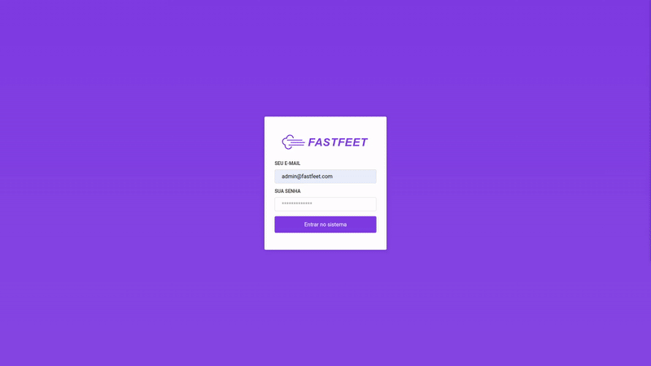

# FastFeet front-end web

Projeto desenvolvido como exercício para certificação do Bootcamp Gostack 10 da Rocketseat. Front-end desenvolvido em ReactJS para uma aplicação de transportadoras controlando as encomendas, entregadores, destinatários e problemas nas entregas.

    

## Tecnologias e libs utilizadas

Abaixo seguem as tecnologias utilizadas no desenvolvimento do projeto:

- ReactJS
- Reactotron
- Redux
- Redux saga
- axios
- date-fns
- styled components
- unform

## Requisitos iniciais

Para poder rodar o projeto, é necessário que os itens abaixo estejam instalados:

- [Node.js](https://nodejs.org/en/download/)
- [npm](https://www.npmjs.com/get-npm) ou [yarn](https://classic.yarnpkg.com/en/docs/install/#mac-stable)
- [git](https://git-scm.com/downloads)

Também será necessário que o back-end da aplicação esteja rodando para que o front-end acesse as rotas da API.

## Instalação

Para instalar o projeto localmente na sua máquina, clonar o repositório (caso tenha clonado o projeto pai `gostack-fastfeet`, não será necessário rodar o comando abaixo pois os arquivos já estarão em sua máquina dentro da pasta frontend):

    git clone https://github.com/gpmarchi/gostack-fastfeet-frontend-web.git && cd gostack-fastfeet-frontend-web

Rodar o comando abaixo para instalar as dependências:

    yarn

## Configuração

Será necessário configurar a variável de ambiente necessária para acessar a API. Para isso criar um arquivo chamado `.env` na raiz do projeto (utilizar como exemplo o arquivo .env.example também presente na raiz do projeto) e informar a variável `REACT_APP_API_BASE_URL` com o endereço onde o servidor da API estiver rodando.

    REACT_APP_API_BASE_URL=http://<endereço ip>:<porta>

## Rodando o projeto

A partir desse momento o ambiente já está preparado para rodarmos a front-end. Para iniciar o servidor de desenvolvimento rodar o comando:

    yarn start

## Testando as funcionalidades

As funcionalidades da aplicação poderão ser testadas através do endereço [http://localhost:3000](http://localhost:3000). Para fazer o login utilizar o usuário padrão de testes:

**usuário**: admin@fastfeet.com

**senha**: 123456
